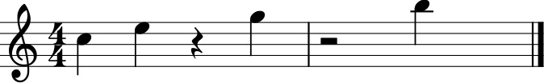

# music21py
[Github](https://github.com/oxygen-dioxide/music21py) | 
[Gitee](https://gitee.com/oxygendioxide/music21py) | 
[Gitlab](https://gitlab.com/oxygen-dioxide/music21py) | 
[Bitbucket](https://bitbucket.org/oxygendioxide/music21py) | 
[Coding](https://oxygen-dioxide.coding.net/public/1/music21py/git/files)


[music21](https://web.mit.edu/music21/doc/index.html)与[musicpy](https://github.com/Rainbow-Dreamer/musicpy)对象互转

## 安装
```
pip install music21py
```

## 使用说明
### `music21py.m21_to_mpy`：music21转musicpy
支持的类型：
|转换前的类型|转换后的类型|说明|
|-|-|-|
|music21.pitch.Pitch|musicpy.note||
|music21.note.Note|musicpy.note|musicpy不支持歌词|
|music21.tempo.MetronomeMark|musicpy.tempo||
|music21.stream.Stream|musicpy.track||
|music21.stream.Measure|musicpy.track||
|music21.stream.Part|musicpy.track||
|music21.stream.Score|musicpy.piece|musicpy不支持节拍|

### `music21py.mpy_to_m21`：musicpy转music21
支持的类型：
|转换前的类型|转换后的类型|说明|
|-|-|-|
|musicpy.note|music21.note.Note||
|musicpy.tempo|music21.tempo.MetronomeMark||
|musicpy.chord|music21.stream.Stream||
|musicpy.track|music21.stream.Part||
|musicpy.piece|music21.stream.Score||

## 示例
```
import music21py
import musicpy
crd=musicpy.chord(['C5', 'E5', 'G5', 'B5'],interval=[0.25,0.5,0.75,1])
strm=music21py.mpy_to_m21(crd)
strm.show()
```


## 为什么要开发这个库
在我看来，musicpy和music21是两个口味不同的Python乐理分析库。

music21偏“学院派”，它的数据结构对标五线谱显示。音高可以用德语、意大利语、盲文等方式显示与输入，时值也支持eighth、16th等字符串形式，支持以基本时值+附点的方式展示与输入。music21严格区分等音，例如`C#`、`D-`、`E---`。music21“大而全”，支持musicxml、abc等多种文件输入输出。在编写与music21集成的程序时，容易陷入困惑：我不知道隐藏在我所操作的变量下面有多少信息量。

而musicpy更符合现代电子音乐人的口味，其基本数据结构“小而精”。例如，用同一种数据结构来表示和弦与旋律段落。musicpy支持常用的运算符号，常用的函数都有简称，使代码大大缩短，开发效率更高（但可维护性变差，如同shell脚本）。

在使用music21时，我绝大多数时间都在与最基本的数据结构打交道，但偶尔也需要使用高级功能。因此，可以用musicpy完成绝大多数操作，在用到高级功能时再使用本库转换为music21对象